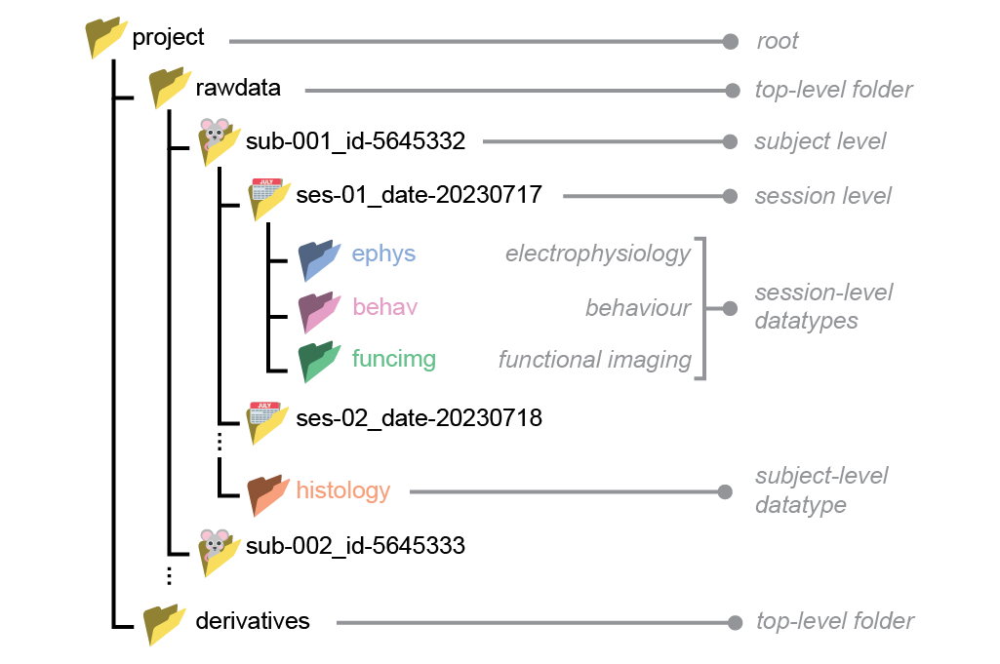
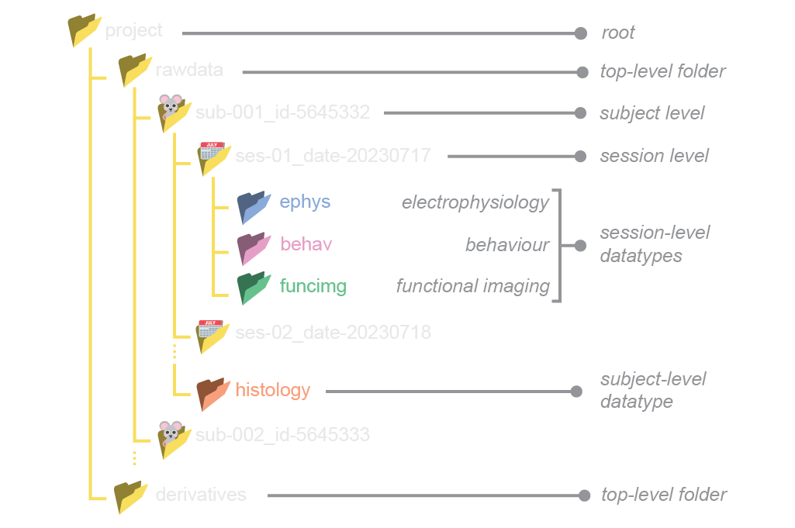

# The specification

The current version of **SWC-Blueprint** mainly aims to enforce a uniform and consistent [project folder structure](#project-folder-structure).
In addition, it also includes some non-mandatory conventions for [naming files](#file-naming-conventions) and storing [tabular metadata](#tabular-metadata).

:::{note}
We mark requirements with italicised *keywords* that should be interpreted as described by the [Network Working Group](https://www.ietf.org/rfc/rfc2119.txt). In decreasing order of requirement, these are: *must* {octicon}`alert;1em;sd-text-danger`, *should* {octicon}`info;1em;sd-text-warning`, and *may* {octicon}`check-circle;1em;sd-text-success`.
:::

## Project folder structure 

Standardised project folders contain data that are hierarchically structured according to the [BIDS standard](https://bids-specification.readthedocs.io/en/stable/02-common-principles.html).

For example:




### Basic principles

* The project folder *may* have any name descriptive of the project, but it *must* be without spaces.

* Within the project folder, data *must* be separated into `rawdata` and `derivatives`. 

  * `rawdata`: coming out of the data acquisition system (e.g. binary files, tiffs, videos files). 

  * `derivatives`: any processed data that is derived from `rawdata` (e.g. spike sorting or pose estimation).

* Data within the `rawdata` folder *must* be hierarchically structured into subject/session/datatype levels. Each level *must* contain at least one folder corresponding to the next (lower) level.

* Subject and session folder names *must* consist of key-value pairs separated by underscores, withous spaces e.g. `sub-001_id-5645332`.

* Datatype folder names *must* be one of the following : `ephys`, `behav`, `funcimg`, `histology`.

* If collected, `ephys`, `behav`, `funcimg` *must* be placed under the session level. If collected, `histology` *must* be placed under the subject level. 

Below we describe each level of the `rawdata` folder hierarchy in more detail. Though we impose no absolute requirements for the folder structure within `derivatives`, it *should* match the hierarchy in `rawdata` whenever possible.

### Subject

* Each subject *must* have exactly one subject-level folder. 
* Subject-level folders *must* be prefixed with a key-value pair that is unique for each subject. The key *must* be `sub` and the value *must* be numerical, e.g. `sub-001`. 
* Subjects *should* be assigned ascending numerical labels as they are added to the project. The labels *should* be prefixed with an arbitrary number of 0s for consistent indentation and sorting, e.g. `sub-001`, `sub-002`, `sub-003`.
* Additional key-value pairs with alphanumerical labels *may* be appended after the `sub` key-value pair. For example, animal IDs (e.g. from the animal facility) can be added as follows: `sub-001_id-5645332`. The keys *should* be consistent across subjects.

:::{hint}
* valid: `sub-02`, `sub-001_id-5645332_sex-F`, `sub-02_species-mouse`
* invalid: 
  * `mouse-01`: the first key should have been `sub`.
  * `sub-001_female`: `female` should have been written as a key-value pair (e.g. `sex-female`)
  * `sub-B`: the `sub` key should have a numerical value
:::

### Session

* Each session *must* have exactly one session-level folder. 
* Session-level folders *must* be prefixed with a key-value pair that is unique for each session. The key *must* be `ses` and the value *must* be numerical, e.g. `ses-01`. 
* Sessions *should* be assigned ascending numerical labels as they are added to the project. The labels *should* be prefixed with an arbitrary number of 0s for consistent indentation and sorting, e.g. `ses-01`, `ses-02`, `ses-03`.
* Additional key-value pairs with alphanumerical labels *may* be appended after the `ses` key-value pair. For example, dates can be added as follows: `ses-001_date-20230310`. The keys *should* be consistent across subjects.
* If a date field is added, it *should* be in the format `YYYYMMDD`.
* Different sessions *may* contain different combinations of datatypes.

:::{hint}
* valid: `ses-02`, `ses-2_date-20230204`
* invalid:
  * `date-20230204_ses-01`: `ses` should have been the first key
  * `session2`: should have been written as `ses-2`
  * `ses-A`: the `ses` key should have a numerical value
:::

### Datatype

The following datatypes are supported:

* `ephys`: electrophysiology (e.g. Neuropixel probes, tetrodes)
* `behav`: behavioural (e.g. video and audio files, response logs)
* `funcimg`: functional imaging (e.g. calcium and voltage imaging)
* `histology`: anatomical (e.g. serial-2-photon images)

:::{note}
Unlike the first three datatypes that belong at the session level, `histology` belongs at the subject level.
:::

### Example project folder
A real project folder might look like:

```
└── project/
    ├── rawdata/
    │   └── sub-001_id-5645332/
    │       ├── ses-01_date-20230310/
    │       │   ├── ephys/
    │       │   │   ├── sub-001_ses-01_recording-01.bin
    │       │   │   └── sub-001_ses-01_probe-3A.imec0
    │       │   └── behav/
    │       │       ├── sub-001_ses-01_camera-01.wav 
    │       │       └── sub-001_ses-01_data-responses.csv 
    │       └── histology/
    │           └── sub-001_image-brain.tiff
    └── derivatives/
        └── sub-001_id-5645332/
            ├── ses-01_date-20230310/
            │   ├── ephys/
            │   │   └── sub-001_ses-01_data-spikes.npy
            │   └── behav/
            │       └── sub-001_ses-01_data-poses.csv
            └── histology/
                └── sub-001_ses-01_data-cellcounts.csv
```

## File naming conventions

**SWC-Blueprint** imposes no absolute requirements on file names. That said, below we provide some recommendations for file names, based on the [BIDS specification](https://bids-specification.readthedocs.io/en/stable/02-common-principles.html#filenames).

:::{admonition} What makes a good file name?
:class: tip
* be nice to humans -> readable and descriptive
* be nice to computers -> parseable and consistent
* use alphanumeric characters `Aa-Zz, 0-9`, dashes `-`, underscores `_`
* avoid spaces and special characters
* use appropriate extensions for each file type (e.g. `.csv`, `.avi`, `.tiff`)
* don't rely on capitalization to distinguish files (some operating systems are case-insensitive)
:::

* File names *should* be formatted as series of key-value pairs ending with a file extension:
```
<key1>-<value1>_<key2>-<value2>_<key3>-<value3>...<keyN>-<valueN>.<extension>
```
* Key-value pairs *should* be separated by underscores while the keys and values are separated by hyphens (e.g. `sub-001_ses-001_key1-value1_key2-value2.csv`).
* Anything after the left-most stop (`.`) is considered as the file extension.
* `sub` and `ses` *should* be included in the filename. This can seem redundant, given that the file is already in a `sub-<label>/ses-<label>` folder, but it makes it easier to identify the file if it is moved out of its original folder.
* Additional information, such as the task name, or run number, *may* be included as further key-value pairs, e.g. `sub-001_ses-001_task-escape_run-001.csv`
* If the acquisition software outputs data with its own mandatory file naming convention, these *should* be placed under a folder that follows the **SWC-Blueprint** naming conventions, e.g.:

```
└── my_project/
    └── rawdata/
        └── sub-001/
            └── ses-001/
                └── behav/
                    └── sub-001_ses-001_task-discrimination_software-cooltool/
                        ├── required-software-output-name-3453234.mp4
                        └── required-software-output-name-3453235.mp4
```

### Example file names
Below we provide some example file names adhering to the **SWC-Blueprint** naming conventions.

```
└── project/
    └── rawdata/
        └── sub-001/
            └── ses-01/
                ├── ephys/
                │   ├── sub-01_ses-01_probe-3A.imec0
                │   ├── sub-01_ses-01_task-retinotopy.lf.bin
                │   ├── sub-01_ses-01_task-discrim_monitor-right_run-01.ap.bin
                │   ├── sub-01_ses-01_task-discrim_monitor-left_run-01.ap.bin
                │   └── sub-01_ses-01_task-discrim_monitor-left_run-02.ap.bin
                └── behav/
                    ├── sub-01_ses-01_task-discrim_monitor-right_run-01.mp4
                    ├── sub-01_ses-01_task-discrim_monitor-left_run-01.mp4
                    └── sub-01_ses-01_task-discrim_monitor-right_run-02.mp4
```

## Metadata conventions

**SWC-Blueprint** imposes no absolute requirements on how to store metadata. That said, we do outline some best practices, in accordance with the [BIDS specification on tabular files](https://bids-specification.readthedocs.io/en/stable/02-common-principles.html#tabular-files).

### Tabular metadata
Tabular metadata, e.g. a table describing the animals in the project, *should* be saved as a tab-separated value file (TSV, ending with `.tsv`) , that is, a CSV file where commas are replaced by tabs. The tab character is a less ambiguous delimiter compared to commas, as it is less likely to appear in data. This makes TSV less prone to parsing errors.

If you are using TSV files, we recommend adhering to the following conventions:
* The first row of the file *should* contain descriptive column names, formatted as snake_case (e.g. `participant_id`, `species`, `date_of_birth`, `sex`, `group`). Avoid blank (that is, an empty string) or duplicate columns names.
* Missing and non-applicable values *should* be coded as `n/a`.
* Numerical values *should* employ the dot (.) as decimal separator and *may* be specified in scientific notation, using e or E to separate the significand from the exponent (e.g. `1.23e-4`)
* TSV files *should* be in UTF-8 encoding.


Here is an example table containing metadata for animal subjects:

```
subject_id  species         sex     group
sub-01      mus musculus    M       control
sub-02      mus musculus    F       control
sub-03      mus musculus    M       treatment
```
